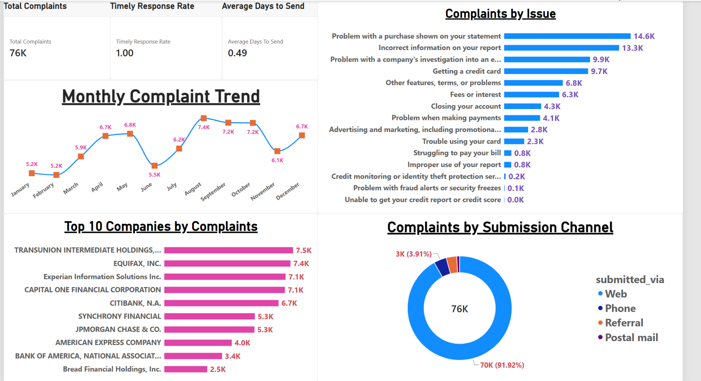
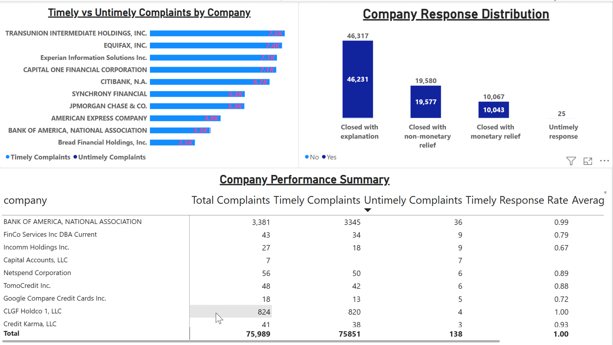
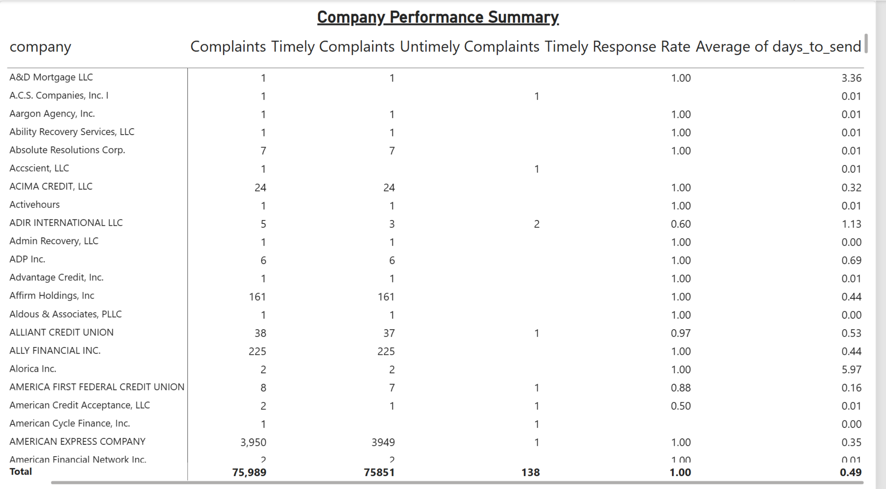
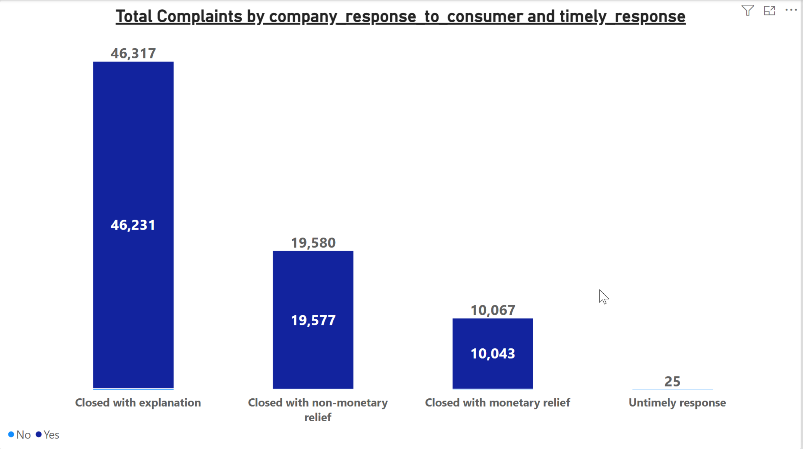
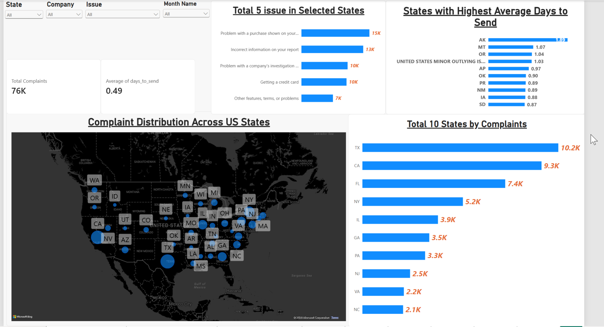
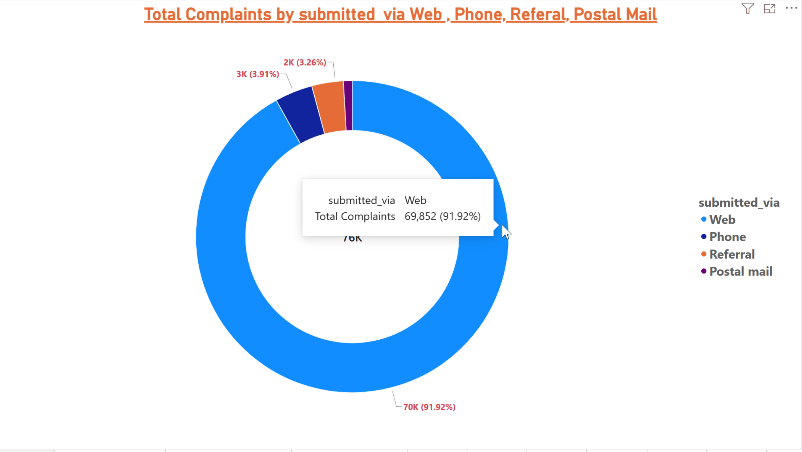
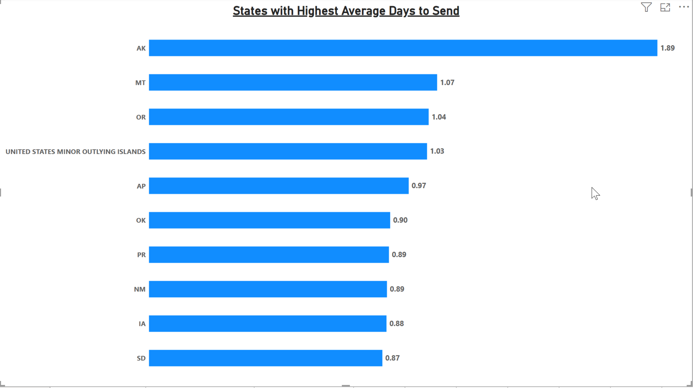
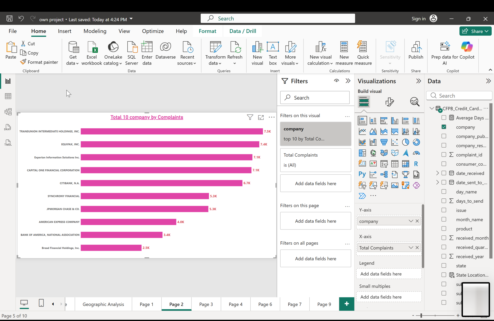
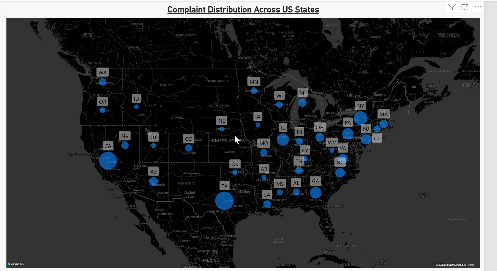

# CFPB Credit Card Complaints Analysis

## 📌 Project Overview

This project presents an end-to-end **Data Analytics analysis of Credit Card Consumer Complaints** using data from the **Consumer Financial Protection Bureau (CFPB)**.

The project follows a complete analytics workflow:

**Raw Data → Python/Pandas Cleaning → MySQL Analysis → Power BI Dashboard → Business Insights**

The objective is to analyze consumer complaints and identify:

- Major complaint issues
- Companies receiving the highest complaint volumes
- Complaint trends over time
- Geographic complaint patterns
- Complaint submission channels
- Company response performance
- Timely vs untimely responses
- Average time taken to send complaints to companies

---

# 🎯 Business Questions

The project was designed to answer questions such as:

1. How many credit card complaints were received?
2. Which companies received the highest number of complaints?
3. What are the most common complaint issues?
4. Which states generate the highest complaint volumes?
5. How do complaints vary month by month?
6. Which channels are most commonly used to submit complaints?
7. What percentage of complaints receive timely responses?
8. Which companies have untimely responses?
9. How long does it take for complaints to be sent to companies?
10. Which states have the highest average complaint forwarding time?
11. How do companies respond to consumers?
12. Which companies or issues may require deeper investigation?

---

# 🛠️ Tools & Technologies

- Python
- Pandas
- NumPy
- MySQL
- SQL
- Power BI
- Power Query
- DAX
- Jupyter Notebook
- Data Cleaning
- Data Transformation
- Feature Engineering
- Exploratory Data Analysis
- Dashboard Development
- Business Analytics

---

# 🔄 Project Workflow

```text
CFPB Credit Card Complaint Dataset
                ↓
          Python / Pandas
     Data Cleaning & Transformation
                ↓
              MySQL
         SQL Data Analysis
                ↓
            Power BI
   Dashboard & KPI Development
                ↓
         Business Insights
```

---

# 📂 Dataset

The project uses consumer complaint data related to **credit card products** from the CFPB Consumer Complaint Database.

Important fields used include:

- Complaint ID
- Date Received
- Date Sent to Company
- Product
- Sub-product
- Issue
- Sub-issue
- Company
- State
- ZIP Code
- Submitted Via
- Company Response to Consumer
- Timely Response
- Consumer Complaint Narrative
- Company Public Response
- Tags

---

# 📊 Dataset / Dashboard Summary

| Metric | Result |
|---|---:|
| Total Complaints | 75,989 |
| Timely Complaints | 75,851 |
| Untimely Complaints | 138 |
| Average Days to Send | 0.49 Days |
| Largest Submission Channel | Web |
| Web Complaints | 69,852 |
| Web Share | 91.92% |
| Highest Complaint State | Texas |
| Texas Complaints | ~10.2K |
| Highest Monthly Complaint Volume | August |
| August Complaints | ~7.4K |

---

# 🧹 Data Cleaning Using Python

The raw dataset was cleaned and transformed using **Python and Pandas** before performing SQL analysis and dashboard development.

---

## 1. Column Name Standardization

Column names were standardized by:

- Removing leading and trailing spaces
- Converting names to lowercase
- Replacing spaces with underscores
- Removing unnecessary special characters

```python
df.columns = (
    df.columns
      .str.strip()
      .str.lower()
      .str.replace(" ", "_")
      .str.replace("?", "", regex=False)
)
```

---

## 2. Date Conversion

The following columns were converted into proper datetime format:

- `date_received`
- `date_sent_to_company`

```python
df["date_received"] = pd.to_datetime(
    df["date_received"],
    errors="coerce",
    utc=True
)

df["date_sent_to_company"] = pd.to_datetime(
    df["date_sent_to_company"],
    errors="coerce",
    utc=True
)
```

---

## 3. Missing Value Handling

Missing categorical values were replaced with meaningful labels.

```python
categorical_columns = [
    "sub_product",
    "sub_issue",
    "company_public_response",
    "state",
    "zip_code",
    "tags"
]

for col in categorical_columns:
    df[col] = df[col].fillna("Not Provided")
```

Missing complaint narratives were handled separately.

```python
df["consumer_complaint_narrative"] = (
    df["consumer_complaint_narrative"]
    .fillna("Narrative Not Available")
)
```

---

## 4. Text Standardization

Important text columns were cleaned and standardized.

These included:

- Product
- Sub-product
- Issue
- Sub-issue
- Company
- State
- Submitted Via
- Company Response to Consumer
- Timely Response

The cleaning process included:

- Removing unnecessary spaces
- Standardizing text formatting
- Handling inconsistent values

---

## 5. ZIP Code Cleaning

ZIP code values were standardized by:

- Converting values to strings
- Removing `.0`
- Validating ZIP code formats
- Keeping valid 3–5 digit values
- Replacing invalid values with `Not Provided`

---

## 6. Timely Response Cleaning

The `timely_response` column was standardized to:

```text
Yes
No
Unknown
```

Unexpected values were classified as `Unknown`.

---

## 7. Duplicate Removal

Duplicate complaints were removed using the unique complaint identifier.

```python
df = df.drop_duplicates(subset=["complaint_id"])
```

---

# ⚙️ Feature Engineering

Additional columns were created to enable time-based and operational analysis.

---

## Date Features

```python
df["received_year"] = df["date_received"].dt.year

df["received_month"] = df["date_received"].dt.month

df["month_name"] = df["date_received"].dt.month_name()

df["received_quarter"] = (
    "Q" + df["date_received"].dt.quarter.astype(str)
)

df["day_name"] = df["date_received"].dt.day_name()
```

These fields allow analysis by:

- Year
- Month
- Quarter
- Day of week

---

## Days to Send

A new operational metric called `days_to_send` was created.

```python
df["days_to_send"] = (
    df["date_sent_to_company"]
    - df["date_received"]
).dt.days
```

This represents:

**Complaint Received → Complaint Sent to Company**

and helps analyze complaint-processing efficiency.

---

# 🗄️ SQL Analysis Using MySQL

After cleaning, the dataset was loaded into **MySQL** for structured analysis.

Example table:

```text
cfpb_credit_card_complaints_2024_cleaned
```

---

## Total Complaints

```sql
SELECT
    COUNT(*) AS total_complaints
FROM cfpb_credit_card_complaints_2024_cleaned;
```

---

## Complaints by Company

```sql
SELECT
    company,
    COUNT(*) AS complaint_count
FROM cfpb_credit_card_complaints_2024_cleaned
GROUP BY company
ORDER BY complaint_count DESC;
```

---

## Complaints by State

```sql
SELECT
    state,
    COUNT(*) AS complaint_count
FROM cfpb_credit_card_complaints_2024_cleaned
GROUP BY state
ORDER BY complaint_count DESC;
```

---

## Most Common Issues

```sql
SELECT
    issue,
    COUNT(*) AS complaint_count
FROM cfpb_credit_card_complaints_2024_cleaned
GROUP BY issue
ORDER BY complaint_count DESC;
```

---

## Issue and Sub-Issue Analysis

```sql
SELECT
    issue,
    sub_issue,
    COUNT(*) AS complaint_count
FROM cfpb_credit_card_complaints_2024_cleaned
GROUP BY issue, sub_issue
ORDER BY complaint_count DESC;
```

---

## Complaints by Month

```sql
SELECT
    received_month,
    month_name,
    COUNT(*) AS complaint_count
FROM cfpb_credit_card_complaints_2024_cleaned
GROUP BY received_month, month_name
ORDER BY received_month;
```

---

## Complaints by Submission Channel

```sql
SELECT
    submitted_via,
    COUNT(*) AS complaint_count
FROM cfpb_credit_card_complaints_2024_cleaned
GROUP BY submitted_via
ORDER BY complaint_count DESC;
```

---

## Timely Response Rate

```sql
SELECT
    ROUND(
        100.0 *
        SUM(
            CASE
                WHEN timely_response = 'Yes'
                THEN 1
                ELSE 0
            END
        )
        / COUNT(*),
        2
    ) AS timely_response_rate
FROM cfpb_credit_card_complaints_2024_cleaned;
```

---

## Average Days to Send Complaint

```sql
SELECT
    AVG(days_to_send) AS avg_days_to_send
FROM cfpb_credit_card_complaints_2024_cleaned
WHERE days_to_send > 0;
```

---

# 📊 Power BI Dashboard

The cleaned dataset was used to create multiple interactive **Power BI dashboards**.

The dashboards analyze:

- Complaint volume
- Complaint trends
- Companies
- Issues
- Geographic distribution
- Submission channels
- Company responses
- Timely responses
- Operational performance

---

# 📈 Important KPIs

The dashboard includes KPI cards such as:

- Total Complaints
- Timely Response Rate
- Average Days to Send
- Timely Complaints
- Untimely Complaints
- Company Complaint Volume

---

# 📅 Date Table

A dedicated date table was created using DAX.

```DAX
DateTable =
CALENDAR(
    MIN(Complaints[date_received]),
    MAX(Complaints[date_received])
)
```

Additional calculated columns included:

```DAX
Year =
YEAR(DateTable[Date])
```

```DAX
Month Number =
MONTH(DateTable[Date])
```

```DAX
Month Name =
FORMAT(DateTable[Date], "MMMM")
```

```DAX
Quarter =
"Q" & FORMAT(DateTable[Date], "Q")
```

```DAX
Day Name =
FORMAT(DateTable[Date], "dddd")
```

`Month Name` was sorted using `Month Number` so that months appear in chronological order.

---

# 🖼️ Dashboard Screenshots

## 1. Complaint Overview Dashboard



The overview dashboard provides:

- Total complaints
- Timely response rate
- Average days to send
- Monthly complaint trends
- Complaints by issue
- Top companies by complaints
- Submission channel distribution

---

## 2. Company Performance Dashboard



This dashboard compares:

- Timely complaints
- Untimely complaints
- Company response distribution
- Total complaints
- Timely response rate
- Company-level performance

---

## 3. Company Performance Summary



This table provides company-level metrics including:

- Total complaints
- Timely complaints
- Untimely complaints
- Timely response rate
- Average days to send

---

## 4. Company Response Distribution



This visualization analyzes company responses such as:

- Closed with explanation
- Closed with non-monetary relief
- Closed with monetary relief
- Untimely responses

---

## 5. Geographic Analysis Dashboard



This dashboard analyzes:

- Complaint distribution across states
- Top complaint states
- State-level complaint issues
- Average days to send by state

It also includes interactive filters for:

- State
- Company
- Issue
- Month

---

## 6. Complaints by Submission Channel



The analysis shows that the **Web** is the dominant complaint submission channel.

Approximately:

**69,852 complaints (91.92%)**

were submitted through the web.

Other channels include:

- Phone
- Referral
- Postal Mail

> Note: The repository currently contains this image as `omplaints-by-submission-channel.png`. It can later be renamed to `complaints-by-submission-channel.png`.

---

## 7. States with Highest Average Days to Send



This visualization identifies states with higher complaint forwarding times.

Among the displayed locations, **Alaska (AK)** had the highest average days to send at approximately:

**1.89 days**

---

## 8. Top 10 Companies by Complaints



Major companies receiving high complaint volumes include:

- TransUnion Intermediate Holdings
- Equifax
- Experian Information Solutions
- Capital One
- Citibank
- Synchrony Financial
- JPMorgan Chase
- American Express
- Bank of America
- Bread Financial Holdings

---

## 9. Complaint Distribution Across U.S. States



This map provides a geographic view of complaint concentration across the United States.

States with larger complaint volumes are represented by larger map markers.

---

# 🔍 Key Insights

## 1. Web is the Dominant Submission Channel

Approximately **91.92% of complaints** were submitted through the web.

This suggests that digital channels are the primary method consumers use to submit financial complaints.

---

## 2. Texas Recorded the Highest Complaint Volume

Texas recorded approximately:

**10.2K complaints**

followed by states including:

- California
- Florida
- New York
- Illinois

---

## 3. August Recorded the Highest Monthly Complaint Volume

Complaint volume peaked at approximately:

**7.4K complaints in August**

Monthly complaint patterns indicate that complaint volume changes meaningfully throughout the year.

---

## 4. Purchase-Related Problems are a Major Issue

One of the most common issues identified was:

**Problem with a purchase shown on your statement**

with approximately:

**14.6K complaints**

Other major issues included:

- Incorrect information on your report
- Problems with company investigations
- Getting a credit card
- Fees or interest
- Closing an account
- Payment-related problems

---

## 5. A Small Number of Companies Account for Large Complaint Volumes

Companies such as:

- TransUnion
- Equifax
- Experian
- Capital One
- Citibank

appear among the highest complaint-volume companies.

However, complaint volume should not automatically be interpreted as poor company performance because larger companies may also serve significantly larger customer bases.

---

## 6. Most Complaints Receive Timely Responses

Out of **75,989 complaints**:

- Timely complaints: **75,851**
- Untimely complaints: **138**

This indicates a very high overall timely response rate.

---

## 7. Complaint Forwarding is Generally Fast

The overall average days to send complaints was approximately:

**0.49 days**

However, some states showed higher averages, which may justify deeper investigation.

---

# 💡 Business Value

The analysis can help organizations and analysts:

- Monitor consumer complaint trends
- Identify common customer pain points
- Compare complaint patterns across companies
- Identify geographic complaint concentration
- Monitor response efficiency
- Detect operational delays
- Prioritize high-frequency complaint issues
- Identify companies requiring deeper investigation
- Support customer-service improvement initiatives
- Build data-driven complaint management strategies

---

# 📁 Repository Structure

```text
cfpb-credit-card-complaints-analysis/
│
├── README.md
│
├── Consumer Financial Complaints Analytics & ...
├── Consumer Financial Complaints Analytics & ...
│
├── company-performance-dashboard.png
├── company-performance-summary.png
├── company-response-distribution.png
├── complaints-overview-dashboard.png
├── geographic-analysis-dashboard.png
├── omplaints-by-submission-channel.png
├── states-highest-average-days-to-send.png
├── top-10-companies-by-complaints.png
└── us-complaint-distribution-map.png
```

---

# 🚀 How to Use the Project

## Python

Install the required libraries:

```bash
pip install pandas numpy jupyter
```

Start Jupyter:

```bash
jupyter notebook
```

Open the project notebook and run the data-cleaning steps.

---

## MySQL

1. Create a MySQL database.
2. Import the cleaned CSV dataset.
3. Create the complaint table.
4. Execute the SQL analysis queries.
5. Validate the results before connecting the data to Power BI.

---

## Power BI

1. Open the project `.pbix` file using **Microsoft Power BI Desktop**.
2. Update the data source path if necessary.
3. Refresh the dataset.
4. Navigate through the dashboard pages.
5. Use slicers and filters to analyze complaints by:
   - State
   - Company
   - Issue
   - Month
   - Response type

---

# 🎯 Skills Demonstrated

This project demonstrates practical knowledge of:

### Python

- Pandas
- NumPy
- Data Cleaning
- Missing Value Handling
- Duplicate Removal
- Datetime Operations
- Feature Engineering

### SQL

- SELECT
- WHERE
- GROUP BY
- ORDER BY
- CASE WHEN
- Aggregations
- COUNT
- AVG
- Date Analysis
- Business Queries

### Power BI

- Power Query
- DAX
- KPI Cards
- Slicers
- Maps
- Bar Charts
- Donut Charts
- Line Charts
- Tables
- Time-Series Analysis
- Dashboard Development

### Analytics

- Exploratory Data Analysis
- Trend Analysis
- Company Analysis
- Geographic Analysis
- Operational Analysis
- Business Insight Generation

---

# 📚 What I Learned

Through this project, I strengthened my understanding of:

- Cleaning real-world datasets using Python
- Handling missing and inconsistent values
- Creating new analytical features
- Writing SQL queries for business analysis
- Translating SQL results into visual insights
- Creating interactive Power BI dashboards
- Designing KPIs
- Performing time-series analysis
- Analyzing company performance
- Performing geographic analysis
- Converting raw data into decision-oriented business insights

---

# 🔮 Future Improvements

Possible future improvements include:

- Normalizing complaint volume using company customer base
- Normalizing state complaints using population
- Complaint narrative text analysis
- Sentiment analysis
- Topic modelling
- Complaint forecasting
- Automated Power BI refresh
- Anomaly detection
- Company benchmarking
- Root-cause drill-down analysis
- Complaint severity scoring

---

# 👤 Author

**Ankur Kumar**

B.Tech  
National Institute of Technology Agartala

---

# ⚠️ Disclaimer

This project is intended for **educational, portfolio, and data analytics demonstration purposes**.

Complaint volume alone should **not** be interpreted as a direct measure of company quality.

Different companies may have significantly different:

- Customer bases
- Market shares
- Transaction volumes
- Product portfolios

Therefore, complaint counts should be interpreted alongside relevant business context.
